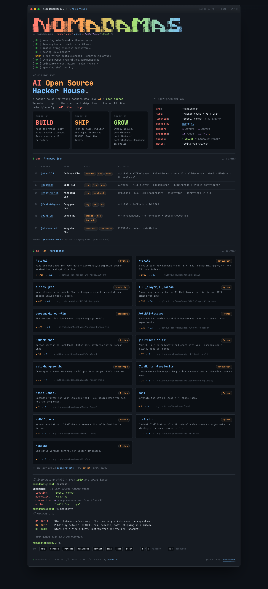

<h1 align="center">
  <a href="https://nomadamas.org"><code>nomadamas.org</code></a>
</h1>

<p align="center">
  Terminal-style landing page for <a href="https://github.com/NomaDamas"><strong>NomaDamas</strong></a> —
  an AI open-source hacker house in Seoul.
</p>

<p align="center">
  <strong>👉 <a href="https://nomadamas.org">https://nomadamas.org</a></strong>
</p>

<p align="center">
  <a href="https://nomadamas.org">
    
  </a>
</p>

---

## Stack

Single `public/index.html` (self-contained; fonts + data + rendered template all live inside the file as base64/JSON). No framework, no build step. Deployed to Cloudflare Pages on every push to `main`.

```
request → Cloudflare Pages edge → public/index.html
```

The `public/` folder is the Pages build output directory; `node_modules/`, `package.json`, etc. stay at the repo root and are ignored by Pages.

## Updating the site

```bash
git clone git@github.com:NomaDamas/nomadamas-landing-page.git
cd nomadamas-landing-page
# edit public/index.html
git commit -am "update: <what changed>"
git push
# live at https://nomadamas.org within ~30 seconds
```

See [`AGENTS.md`](AGENTS.md) for the safe edit pattern when touching CSS/JS inside the bundler template (JSON round-trip required).

## Local preview (optional)

```bash
npm install
npm start          # http-server public/ on http://127.0.0.1:3030
```

`http-server` runs with `-c-1` (no cache) so edits reflect on browser refresh.

## Deployment

Cloudflare Pages project `nomadamas-landing-page` connected to this repo.

| Setting | Value |
|---|---|
| Build command | `exit 0` |
| Build output directory | `public` |
| Framework preset | None |
| Custom domains | `nomadamas.org`, `landing.nomadamas.org` |
| Production branch | `main` |

Push to `main` → Pages auto-deploys. Rollback: CF Dashboard → Workers & Pages → `nomadamas-landing-page` → Deployments → past deployment → **Rollback** (< 1 minute, no git history pollution).

## What's inside `public/index.html`

- Boot sequence animation (8 lines, one per 90ms)
- Hero: mission + BUILD/SHIP/GROW pills + `whoami.yml` stats
- Members table (6 rows; card-stack on mobile)
- 15 project cards across `NomaDamas/`, `Marker-Inc-Korea/`, `vkehfdl1/` orgs
- Interactive shell — auto-types `whoami` then `manifesto`; accepts `help`, `members`, `projects`, `manifesto`, `contact`, `join`, `sudo`, `clear`, and per-project `open <name>`
- Sequential line-by-line reveal animation after page load, respecting `prefers-reduced-motion`

The `<script type="__bundler/template">` block stores the actual rendered HTML as a JSON-encoded string. On page load, a bootstrap script parses the template JSON, inlines base64-decoded font blobs, replaces `document.documentElement`, and re-creates each `<script>` so inline scripts execute.

## Mobile

Tested at 360 / 375 / 393 / 768 px viewports.

- `≤900px` — hero collapses to 1 column
- `≤720px` — BUILD/SHIP/GROW pills stack; project cards go 1 column
- `≤600px` — members table becomes a card stack, one row per member
- `≤480px` / `≤380px` — ASCII logo scales down to 7px / 6px monospace

## Editing data

Project cards + member list are hardcoded in the `data` object inside the template's render script.

- `data.projects` — add an object `{ name, owner, desc, lang, stars, forks, url }`. The stats bar (`15 repos · 10,444 ★`) auto-sums.
- `data.members` — add an object `{ handle, name, tags, notable }`.
- Non-NomaDamas repos must include an `owner` field (e.g. `Marker-Inc-Korea`, `vkehfdl1`). The card URL uses `${p.owner}/${p.name}`.
- GitHub star counts are static snapshots — refresh manually when they drift.

All data edits go through the JSON round-trip pattern described in [`AGENTS.md`](AGENTS.md).
